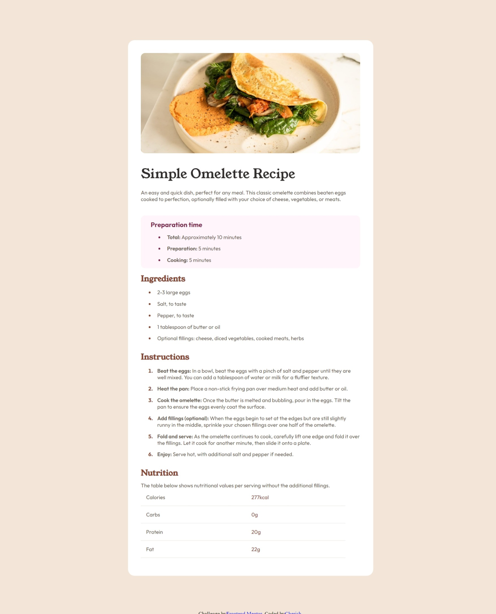

# Frontend Mentor - Recipe page solution

This is a solution to the [Recipe page challenge on Frontend Mentor](https://www.frontendmentor.io/challenges/recipe-page-KiTsR8QQKm). Frontend Mentor challenges help you improve your coding skills by building realistic projects.

## Overview

This project is a responsive recipe landing page built with HTML and CSS. It aims to provide users with a visually appealing and informative introduction to a recipe or a collection of recipes.

### Screenshot

### Links

- Solution URL: [Add solution URL here](https://github.com/Amablac/Frontend-Mentor-Recipe-page)
- Live Site URL: [Add live site URL here](https://amablac.github.io/Frontend-Mentor-Recipe-page/)

## My process

This section details your approach to building the landing page.

Built With:
HTML, 
CSS.

### What I learned

In this project I learnt how to carefully make use of margins and padding to archive this, while learning the units.

## Author

- Website - [Cherish](https://www.your-site.com)
- Frontend Mentor - [@Amablac](https://www.frontendmentor.io/profile/Amablac)
- Twitter - [@Amablac](https://www.twitter.com/yourusername)

## Acknowledgments
I'm thanking God almighty for giving me the wisdom and guide through this.
